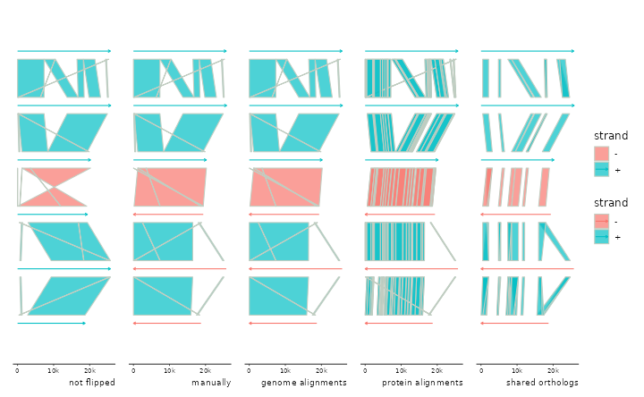
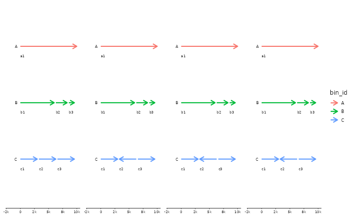
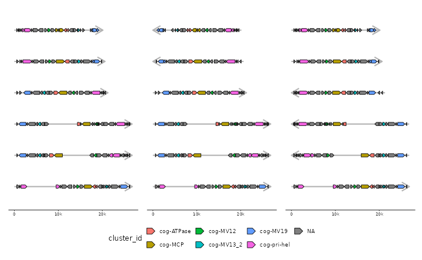

# Advanced flip examples

``` r
library(gggenomes)
```

    ## Loading required package: ggplot2

    ## gggenomes v1.1.3
    ## 
    ## If you use 'gggenomes' in published research, please cite:
    ## 
    ## Hackl T, Ankenbrand M, van Adrichem B, Wilkins D, Haslinger K (2024).
    ## "gggenomes: effective and versatile visualizations for comparative
    ## genomics." _arXiv_. doi:10.48550/arXiv.2411.13556
    ## <https://doi.org/10.48550/arXiv.2411.13556>.

    ## 
    ## Attaching package: 'gggenomes'

    ## The following object is masked from 'package:graphics':
    ## 
    ##     layout

``` r
library(patchwork)
```

``` r
p <- gggenomes(genes=emale_genes) +
  geom_seq(aes(color=strand), arrow=TRUE) +
  geom_link(aes(fill=strand)) +
  expand_limits(color=c("-")) +
  labs(caption="not flipped")
```

    ## No seqs provided, inferring seqs from feats

``` r
# nothing flipped
p0 <- p %>% add_links(emale_ava)

# flip manually
p1 <- p %>% add_links(emale_ava) %>%
  flip(4:6) + labs(caption="manually")

# flip automatically based on genome-genome links
p2 <- p %>% add_links(emale_ava) %>%
  sync() + labs(caption="genome alignments")
```

    ## Flipping: E4-10_086,E4-10_112,RCC970_016B

``` r
# flip automatically based on protein-protein links
p3 <- p %>% add_sublinks(emale_prot_ava) %>%
  sync() + labs(caption="protein alignments")
```

    ## Transforming sublinks with "aa2nuc". Disable with `.transform = "none"`
    ## Flipping: E4-10_086,E4-10_112,RCC970_016B

``` r
# flip automatically based on genes linked implicitly by belonging
# to the same clusters of orthologs (or any grouping of your choice)
p4 <- p %>% add_clusters(emale_cogs) %>%
  sync() + labs(caption="shared orthologs")
```

    ## Joining with `by = join_by(feat_id)`
    ## Flipping: E4-10_086,E4-10_112,RCC970_016B

``` r
p0 + p1 + p2 + p3 + p4 + plot_layout(nrow=1, guides="collect")
```



``` r
# flip seqs inside bins
s0 <- tibble::tibble(
  bin_id = c("A", "B", "B", "B", "C", "C", "C"),
  seq_id = c("a1","b1","b2","b3","c1","c2","c3"),
  length = c(1e4, 6e3, 2e3, 1e3, 3e3, 3e3, 3e3))

p <- gggenomes(seqs=s0) +
  geom_seq(aes(color=bin_id), size=1, arrow = arrow(angle = 30, length = unit(10, "pt"),
    ends = "last", type = "open")) +
  geom_bin_label() + geom_seq_label() +
  expand_limits(color=c("A","B","C"))
```

    ## Warning: Using `size` aesthetic for lines was deprecated in ggplot2 3.4.0.
    ## ℹ Please use `linewidth` instead.
    ## ℹ The deprecated feature was likely used in the gggenomes package.
    ##   Please report the issue at <https://github.com/thackl/gggenomes/issues>.
    ## This warning is displayed once per session.
    ## Call `lifecycle::last_lifecycle_warnings()` to see where this warning was
    ## generated.

``` r
p1 <- p %>% flip_seqs(6)
p2 <- p %>% flip_seqs(c2)
p3 <- p %>% flip_seqs(2, .bins = C)

p + p1 + p2 + p3 + plot_layout(nrow=1, guides="collect")
```



``` r
# fancy flipping using tidyselect::where for dynamic selection
p <- gggenomes(emale_genes,emale_seqs) %>% add_clusters(emale_cogs) +
  geom_seq(color="grey70", linewidth=1, arrow = arrow(angle = 30, length = unit(15, "pt"),
    ends = "last", type = "open")) +
  geom_gene(aes(fill=cluster_id))
```

    ## Joining with `by = join_by(feat_id)`

``` r
# flip all short seqs - where() applied to .bin_track=seqs
p1 <- p %>% flip(where(~.x$length < 21000))

# flip all seqs with MCP on "-" - where() applied to .bin_track=genes
p2 <- p %>% flip(where(~any(.x$strand[.x$cluster_id %in% "cog-MCP"] == "-")), .bin_track=genes)

p + p1 + p2 + plot_layout(nrow=1, guides="collect") & theme(legend.position = "bottom")
```


