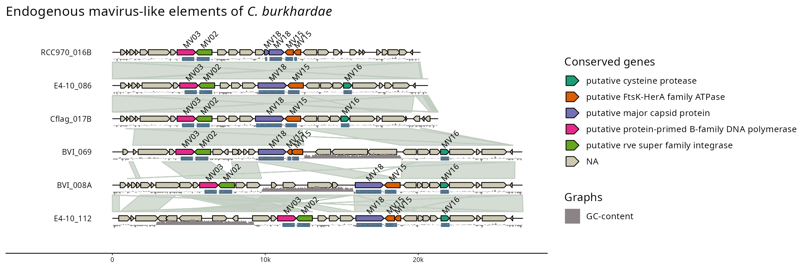
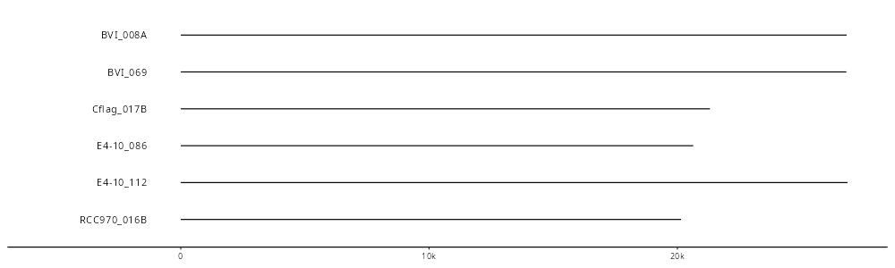
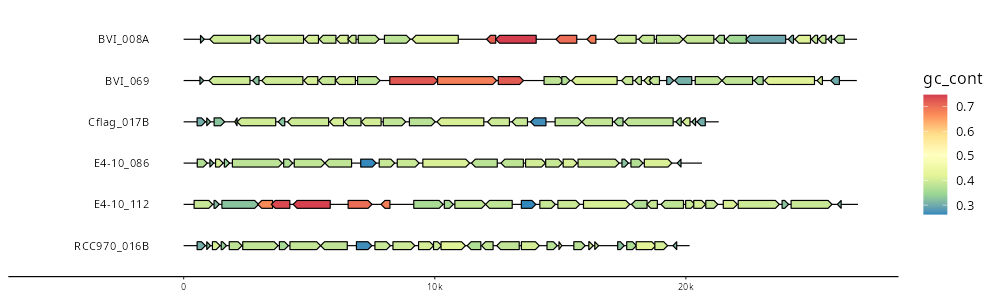
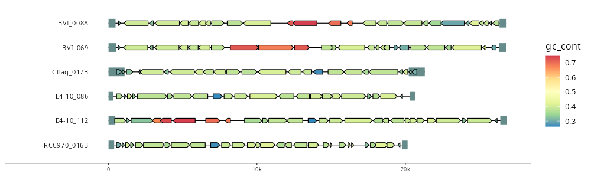
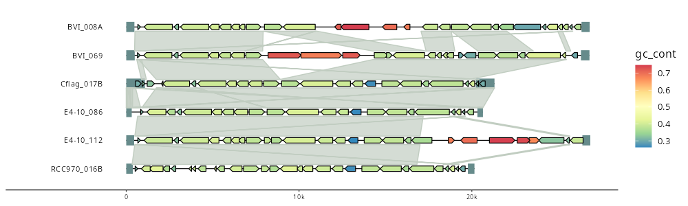
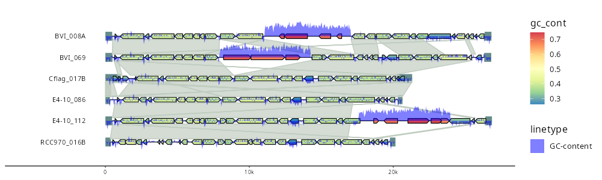
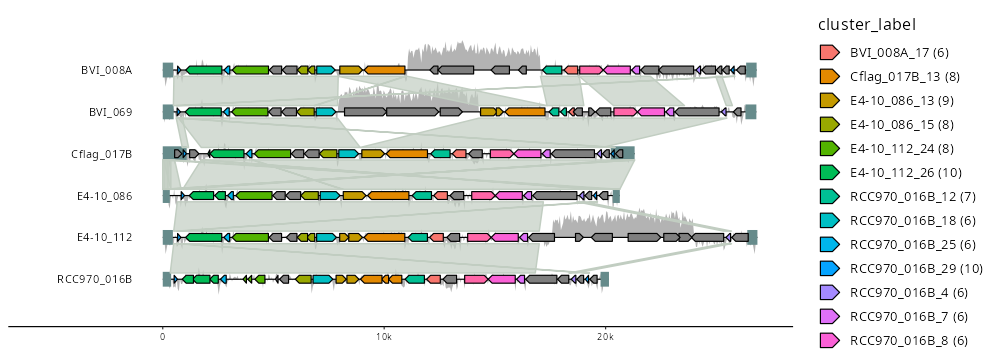

This tutorial uses a real-world dataset to show how `gggenomes` can be used to explore synteny among viral genomes. We start with six viral genomes and progressively add gene annotations, terminal repeats, pairwise genome alignments, GC content, protein clusters, and functional annotations. 

Along the way, we introduce the main data types and plotting layers used by `gggenomes` and build the final synteny map one step at a time.
The final figure will look like this:



All processed data files are provided in the `data/` directory, so you can run the complete R workflow without installing any external bioinformatics tools. For reproducibility, we also show the command-line steps used to generate these files, but running them is optional.

The example is based on endogenous mavirus-like elements (EMALEs) from the marine heterotrophic flagellate *Cafeteria burkhardae*, described by [Hackl et al. 2021](https://doi.org/10.7554/elife.72674).

The data used in this example is also bundled as R objects in the package; see `data(package = "gggenomes")`.

### Download and unpack the tutorial data

To follow the tutorial locally, download and unpack the tutorial data from R:

```{r eval=FALSE}
download.file(
  "https://github.com/thackl/gggenomes/releases/download/v1.1.3/vignettes.tar.gz",
  "gggenomes-tutorials.tar.gz",
  mode = "wb"
)
untar("gggenomes-tutorials.tar.gz", exdir = "gggenomes-tutorials")
setwd("gggenomes-tutorials")
```

You can now copy the R code below into an interactive R session, or open the included `emales.Rmd` file and run the tutorial from there.


### Read in the genomes

We start with a FASTA file containing six viral genomes. `read_seqs()` reads the sequence lengths and metadata from the FASTA headers into a table that can be passed directly to `gggenomes`.

``` {r eval=FALSE}
library(gggenomes)

# Read one row of sequence information per genome
emale_seqs <- read_seqs("data/emales.fna")

# Initialize a plot with one genome ("bin") per sequence
p1 <- gggenomes(seqs = emale_seqs) +
  geom_seq() +       # draw the sequence backbone
  geom_bin_label()   # label each genome

p1

ggsave("emales-p1.png", p1, width = 10, height = 3, dpi = 100)
```



At this stage, the plot contains only the genome sequences and their labels. Next, we add information about the genes encoded by each genome.


### Annotate genes

The supplied gene annotations were generated with Prodigal-GV. This preprocessing step is shown for reproducibility; the resulting GFF file is already included with the tutorial data.

``` {bash eval=FALSE}
bin/prodigal-gv -i data/emales.fna -o data/emales.gff -f gff -a data/emales.faa
```

`read_feats()` reads the GFF annotations as genomic features. Here we color genes by their GC content to add a first layer of information to the genome map.

``` {r eval=FALSE}
emale_genes <- read_feats("data/emales.gff") |>
  # GC content is stored as text in the GFF attributes; convert it to numeric
  dplyr::mutate(gc_cont = as.numeric(gc_cont))

p2 <- gggenomes(genes = emale_genes, seqs = emale_seqs) +
  geom_seq() +
  geom_bin_label() +
  geom_gene(aes(fill = gc_cont)) +
  scale_fill_distiller(palette = "Spectral")

p2

ggsave("emales-p2.png", p2, width = 10, height = 3, dpi = 100)
```



The genome backbones are now accompanied by gene arrows, with color showing variation in GC content among genes.


### Find terminal inverted repeats

These types of viruses often have linear genomes with terminal inverted repeats (TIRs), so we look for matching regions at opposite ends of each genome. The commands below split the genomes and self-align their opposite strands; the resulting PAF file is already provided.

``` {bash eval=FALSE}
# Split into one genome per file | https://bioinf.shenwei.me/seqkit/
bin/seqkit split --force -i data/emales.fna

# Self-align opposite strands
for fna in `ls data/emales.fna.split/*.fna`; do
  bin/minimap2 -c -B5 -O6 -E3 --rev-only $fna $fna > $fna.paf;
done;
cat data/emales.fna.split/*.paf > data/emales-tirs.paf
```

We read the alignments as features and retain only sufficiently long, closely matching hits. `geom_feat()` then adds these regions to the genome tracks.

``` {r eval=FALSE}
# Keep candidate TIRs of at least 100 bp and less than 10% divergence
emale_tirs <- read_links("data/emales-tirs.paf") |>
  dplyr::filter(map_length > 99 & de < 0.1)

p3 <- gggenomes(
  genes = emale_genes,
  seqs = emale_seqs,
  feats = emale_tirs
) +
  geom_seq() +
  geom_bin_label() +
  geom_feat(linewidth = 5) +
  geom_gene(aes(fill = gc_cont)) +
  scale_fill_distiller(palette = "Spectral")

p3

ggsave("emales-p3.png", p3, width = 10, height = 3, dpi = 100)
```



The thick feature segments mark the candidate terminal repeats, adding structural information beyond the gene annotations.


### Compare genome synteny

To compare genome organization, we align all genomes against each other with minimap2. `gggenomes` represents these pairwise alignments as links between homologous regions.

``` {bash eval=FALSE}
# All-vs-all genome alignment | https://github.com/lh3/minimap2
bin/minimap2 -X -N 50 -p 0.1 -c data/emales.fna data/emales.fna > data/emales.paf
```

``` {r eval=FALSE}
emale_links <- read_paf("data/emales.paf")

p4 <- gggenomes(
  genes = emale_genes,
  seqs = emale_seqs,
  feats = emale_tirs,
  links = emale_links
) +
  geom_seq() +
  geom_bin_label() +
  geom_feat(linewidth = 5) +
  geom_gene(aes(fill = gc_cont)) +
  geom_link() +
  scale_fill_distiller(palette = "Spectral")

# Flip genomes 4-6 so that shared regions are easier to compare visually
p4 <- p4 |> flip(4:6)
p4

ggsave("emales-p4.png", p4, width = 10, height = 3, dpi = 100)
```



The links reveal shared regions and their relative orientation across genomes. `flip()` changes only how selected genomes are displayed, making the syntenic structure easier to follow.


### Add genome-wide GC content

So far, GC content is shown only for individual genes. We can also calculate it across the entire genome in fixed windows and display the result as a continuous track.

``` {bash eval=FALSE}
# Compute GC content in non-overlapping 50 bp windows | https://bioinf.shenwei.me/seqkit/
bin/seqkit sliding -s 50 -W 50 data/emales.fna |
  bin/seqkit fx2tab --gc -ni > data/emales-gc.tsv
```

The output is a simple table of window IDs and GC content. We extract the sequence ID and coordinates from each window ID to turn it into a feature table understood by `gggenomes`.

``` {r eval=FALSE}
emale_gc <- readr::read_tsv(
  "data/emales-gc.tsv",
  col_names = c("window_id", "gc_content")
) |>
  # Window IDs have the form "seq_id_sliding:start-end"
  dplyr::mutate(
    seq_id = stringr::str_remove(window_id, "_sliding:.*"),
    start = as.integer(stringr::str_extract(window_id, "(?<=_sliding:)\\d+")),
    end = as.integer(stringr::str_extract(window_id, "\\d+$"))
  )

# Register the GC windows as an additional feature set
p5 <- p4 |> add_feats(emale_gc)

# Select this feature set for a wiggle track
p5 <- p5 +
  geom_wiggle(
    aes(z = gc_content, linetype = "GC-content"),
    feats(emale_gc),
    fill = "blue",
    alpha = .5
  )

p5

ggsave("emales-p5.png", p5, width = 10, height = 3, dpi = 100)
```



The GC-content profile is now shown as an additional quantitative track along each genome. This illustrates how arbitrary position-based measurements can be added as feature sets and plotted alongside genes and synteny links.


### Cluster proteins into orthogroups

The next step groups similar proteins across genomes. We use DIAMOND to cluster the predicted proteins; the cluster assignments are again included with the tutorial data.

``` {bash eval=FALSE}
bin/diamond makedb --in data/emales.faa --db data/emales.dmnd
bin/diamond cluster --db data/emales.dmnd -o data/emales-clusters.tsv
```

We count the number of genes in each cluster and create labels only for clusters represented by at least six genes. These shared clusters can then be used to color homologous genes consistently across genomes.

``` {r eval=FALSE}
# Read cluster assignments and count genes per cluster
emale_clusters <- readr::read_tsv(
  "data/emales-clusters.tsv",
  col_names = c("cluster_id", "feat_id")
) |>
  dplyr::group_by(cluster_id) |>
  dplyr::add_count(name = "cluster_n") |>
  dplyr::ungroup()

emale_clusters <- emale_clusters |>
  dplyr::mutate(
    cluster_label = paste0(cluster_id, " (", cluster_n, ")"),
    # Highlight only clusters with at least six members
    cluster_label = forcats::fct_lump_min(
      cluster_label, 6, other_level = NA_character_
    )
  )

# Prodigal-GV uses generic gene IDs in the GFF (1_1, 3_5, ...), whereas
# its protein FASTA uses IDs such as "seq_id_1". Harmonize the IDs so the
# gene annotations can be joined to results from the protein analyses.
emale_genes <- emale_genes |>
  dplyr::mutate(
    feat_id = paste0(seq_id, "_", stringr::str_remove(feat_id, ".*_"))
  )

p6 <- gggenomes(
  genes = emale_genes,
  seqs = emale_seqs,
  feats = emale_tirs,
  links = emale_links
) |>
  add_feats(emale_gc) |>
  # Associate genes through their shared protein-cluster IDs
  add_clusters(emale_clusters) |>
  flip(4:6) +
  geom_wiggle(
    aes(z = gc_content, linetype = "GC-content"),
    feats(emale_gc),
    fill = "black",
    alpha = .3
  ) +
  geom_seq() +
  geom_bin_label() +
  geom_feat(size = 5, data = feats()) +
  geom_gene(aes(fill = cluster_label)) +
  geom_link()

p6

ggsave("emales-p6.png", p6, width = 10, height = 3.5, dpi = 100)
```



Genes belonging to the same abundant protein cluster now share a color. This makes conserved gene content visible together with larger-scale genome synteny.


### Add functional annotations

Finally, we add functional information based on similarity to proteins from mavirus. DIAMOND is used for the similarity search; the resulting table is included with the tutorial data.

``` {bash eval=FALSE}
# Search predicted EMALE proteins against published mavirus proteins
bin/diamond makedb --in data/mavirus.faa --db data/mavirus.dmnd
bin/diamond blastp --db data/mavirus.dmnd -q data/emales.faa --very-sensitive --outfmt 6 qseqid sseqid pident length mismatch gapopen qstart qend sstart send evalue bitscore stitle > data/emales_mavirus.o6
```

We extract gene names and product descriptions from significant hits and attach these annotations to the corresponding genes and protein clusters.

``` {r eval=FALSE}
# Extract functional annotations from significant mavirus protein hits
emale_blast <- read_blast("data/emales_mavirus.o6") |>
  dplyr::rename(feat_id = seq_id, blast_desc = X13) |>
  dplyr::filter(evalue < 1e-3) |>
  dplyr::mutate(
    gene = stringr::str_extract(blast_desc, "(?<=gene=)\\S+"),
    product = stringr::str_extract(blast_desc, "(?<=product=).*")
  )

# Add functional annotations to the protein-cluster table
emale_clusters_blast <- emale_clusters |>
  dplyr::left_join(
    dplyr::select(emale_blast, feat_id, gene, product)
  )

# Manual transposon annotations can be added as another feature set if desired:
# emale_transposons <- read_gff("emales-manual.gff", types = c("mobile_element"))

p7 <- gggenomes(
  genes = emale_genes,
  seqs = emale_seqs,
  feats = emale_tirs,
  links = emale_links
) |>
  add_feats(emale_gc) |>
  add_clusters(emale_clusters_blast) |>
  # add_features(emale_transposons) |>
  # Associate BLAST hits with their parent genes
  add_subfeats(emale_blast) |>
  # Reorder the genomes for the final figure
  pick(6, 4, 3, 2, 1, 5) |>
  # Use the synteny links to orient genomes consistently
  sync() +

  geom_seq() +
  geom_bin_label() +
  # Leave some extra space around genome tracks for the annotations below
  geom_link(offset = c(0.3, 0.2)) +
  # geom_feat(aes(color = "integrated transposon"),
  #   feats(emale_transposons), size = 7) +
  geom_gene(aes(fill = product)) +
  geom_gene_tag(aes(label = gene), size = 3, nudge_y = 0.1) +
  # Mark genes with significant mavirus protein hits
  geom_feat(
    data = feats(emale_blast),
    size = 2,
    position = position_nudge(y = -.2),
    color = "skyblue4"
  ) +
  # Add the genome-wide GC-content track below the genes
  geom_wiggle(
    aes(z = gc_content, linetype = "GC-content"),
    feats(emale_gc),
    fill = "lavenderblush4",
    position = position_nudge(y = -.2),
    height = .2
  ) +

  scale_fill_brewer(
    "Conserved genes", palette = "Dark2", na.value = "cornsilk3"
  ) +
  scale_color_viridis_d("Blast hits & Features", direction = -1) +
  scale_linetype("Graphs") +
  ggtitle(expression(paste(
    "Endogenous mavirus-like elements of ",
    italic("C. burkhardae")
  )))

p7

ggsave("emales-p7.png", p7, width = 12, height = 4, dpi = 200)
```


The final figure combines genome structure, pairwise synteny, conserved gene content, functional annotations, and GC content in a single view. More importantly for this tutorial, each of these layers was added independently: the same pattern can be used to build genome comparison figures from many different combinations of sequence, feature, link, and quantitative data.
