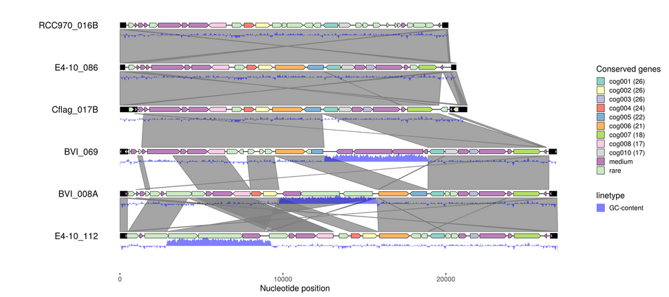

This is a real-life example demonstrating the use of `gggenomes` to explore
viral genomes. We start with just a bunch of viral contigs and ask: Is there
anything interesting going on here?

We use a few bioinformatics commandline tools to run some analyzes, and
visualize the results using `gggenomes`. By successively adding new data as new
tracks we build a rich plot that ultimatly reveals novel insights into an
exciting system.

This example is bundled `data(package="gggenomes")`
To rerun the this example including the bioinformatics analyzes download the
[raw data](https://github.com/thackl/gggenomes/tree/master/data-raw/emales) from
github.

TODO Teaser (plot preview)

TODO Which tools I used


### Read in the genomes

We start with a fasta file of 33 viral genomes. We read sequence length
and some metadata from the header lines using \`read~fai~\`...

``` {r eval=FALSE}
library(tidyverse)
library(gggenomes)

# parse sequence length and some metadata from fasta file
emale_seqs <- read_fai("emales.fna") %>%
  extract(seq_desc, into = c("emale_type", "is_typespecies"), "=(\\S+) \\S+=(\\S+)",
    remove=F, convert=T) %>%
  arrange(emale_type, length)

# plot the genomes - first six only to keep it simple for this example
emale_seqs_6 <- emale_seqs[1:6,]
p1 <- gggenomes(emale_seqs_6) +
 geom_seq() + geom_bin_label()
p1
```


### Annotate genes

``` {bash eval=FALSE}
# https://github.com/thackl/seq-scripts
seq-join -n emales-concat < emales.fna > emales-concat.fna                       
# Annotate genes | https://github.com/hyattpd/Prodigal
prodigal -n -t emales-prodigal.train -i emales-concat.fna                                 
prodigal -t emales-prodigal.train -i emales.fna -o emales-prodigal.gff -f gff
# A little help to clean up the prodigal gff | https://github.com/thackl/seq-scripts
gff-clean emales-prodigal.gff > emales.gff
```

``` {r eval=FALSE}
emale_genes <- read_gff("emales.gff") %>%
  rename(feature_id=ID) %>%                       # we'll need this later
  mutate(gc_cont=as.numeric(gc_cont))             # per gene GC-content

p2 <- gggenomes(emale_seqs_6, emale_genes) +
  geom_seq() + geom_bin_label() +
  geom_gene(aes(fill=gc_cont)) +
  scale_fill_distiller(palette="Spectral")
p2
```


### Find terminal inverted repeats

It is known that these type of viruses often have linear genomes with
terminal inverted repeats (TIRs). So let's look for those next.

``` {bash eval=FALSE}
# split into one genome per file | https://bioinf.shenwei.me/seqkit/
seqkit split -i emales.fna  
# self-align opposite strands                        
for fna in `ls emales.fna.split/*.fna`; do
  minimap2 -c -B5 -O6 -E3 --rev-only $fna $fna > $fna.paf;
done;
cat emales.fna.split/*.paf > emales-tirs.paf
```

``` {r eval=FALSE}
# prefilter hits by minimum length and maximum divergence
emale_tirs_paf <- read_paf("emales-tirs.paf") %>%
  filter(seq_id1 == seq_id2 & start1 < start2 & map_length > 99 & de < 0.1)
emale_tirs <- bind_rows(
  select(emale_tirs_paf, seq_id=seq_id1, start=start1, end=end1, de),
  select(emale_tirs_paf, seq_id=seq_id2, start=start2, end=end2, de))

p3 <- gggenomes(emale_seqs_6, emale_genes, emale_tirs) +
  geom_seq() + geom_bin_label() +
  geom_feature(size=5) +
  geom_gene(aes(fill=gc_cont)) +
  scale_fill_distiller(palette="Spectral")
p3
```


### Compare genome synteny

``` {bash eval=FALSE}
# All-vs-all alignment | https://github.com/lh3/minimap2
minimap2 -X -N 50 -p 0.1 -c emales.fna emales.fna > emales.paf
```

``` {r eval=FALSE}
emale_links <- read_paf("emales.paf")

p4 <- gggenomes(emale_seqs_6, emale_genes, emale_tirs, emale_links) +
  geom_seq() + geom_bin_label() +
  geom_feature(size=5, data=use_features(features)) +
  geom_gene(aes(fill=gc_cont)) +
  geom_link() +
  scale_fill_distiller(palette="Spectral")

p4 <- p4 %>% flip_bins(3:5)
p4
```


### GC-content

``` {bash eval=FALSE}
# https://github.com/thackl/seq-scripts (bedtools & samtools)
seq-gc -Nbw 50 emales.fna > emales-gc.tsv
```

``` {r eval=FALSE}
emale_gc <- thacklr::read_bed("emales-gc.tsv") %>%
  rename(seq_id=contig_id)

p5 <- p4 %>% add_features(emale_gc)
p5 <- p5 + geom_ribbon(aes(x=(x+xend)/2, ymax=y+.24, ymin=y+.38-(.4*score),
    group=seq_id, linetype="GC-content"), use_features(emale_gc),
                       fill="blue", alpha=.5)
p5
```


### cluster protein sequences into orthogroups

``` {bash eval=FALSE}
gff2cds --aa --type CDS --source Prodigal_v2.6.3 --fna emales.fna emales.gff > emales.faa
mmseqs easy-cluster emales.faa emales-mmseqs /tmp -e 1e-5 -c 0.7;
cluster-ids -t "cog%03d" < emales-mmseqs_cluster.tsv > emales-cogs.tsv
```

``` {r eval=FALSE}
emale_cogs <- read_tsv("emales-cogs.tsv", col_names = c("feature_id", "cluster_id", "cluster_n"))
emale_cogs %<>% mutate(
  cluster_label = paste0(cluster_id, " (", cluster_n, ")"),
  cluster_label = fct_lump_min(cluster_label, 5, other_level = "rare"),
  cluster_label = fct_lump_min(cluster_label, 15, other_level = "medium"),
  cluster_label = fct_relevel(cluster_label, "rare", after=Inf))
emale_cogs


p6 <- gggenomes(emale_seqs_6, emale_genes, emale_tirs, emale_links) %>%
  add_features(emale_gc) %>%
  add_clusters(genes, emale_cogs) %>%
  flip_bins(3:5) +
  geom_seq() + geom_bin_label() +
  geom_feature(size=5, data=use_features(features)) +
  geom_gene(aes(fill=cluster_label)) +
  geom_link() +
  geom_ribbon(aes(x=(x+xend)/2, ymax=y+.24, ymin=y+.38-(.4*score),
    group=seq_id, linetype="GC-content"), use_features(emale_gc),
                       fill="blue", alpha=.5) +
  scale_fill_brewer("Conserved genes", palette="Set3")

p6
```



### Blast hits and integrated transposons

``` {bash eval=FALSE}
# mavirus.faa - published
blastp -query emales.faa -subject mavirus.faa -outfmt 7 > emales_mavirus-blastp.tsv
perl -ne 'if(/>(\S+) gene=(\S+) product=(.+)/){print join("\t", $1, $2, $3), "\n"}' \
  mavirus.faa > mavirus.tsv
```

``` {r eval=FALSE}
emale_blast <- read_blast("emales_mavirus-blastp.tsv")
emale_blast %<>%
  filter(evalue < 1e-3) %>%
  select(feature_id=qaccver, start=qstart, end=qend, saccver) %>%
  left_join(read_tsv("mavirus.tsv", col_names = c("saccver", "blast_hit", "blast_desc")))

# manual annotations by MFG
emale_transposons <- read_gff("emales-manual.gff", types = c("mobile_element"))


p7 <- gggenomes(emale_seqs_6, emale_genes, emale_tirs, emale_links) %>%
  add_features(emale_gc) %>%
  add_clusters(genes, emale_cogs) %>%
  add_features(emale_transposons) %>%
  add_subfeatures(genes, emale_blast, transform="aa2nuc") %>%
  flip_bins(3:5) +
  geom_feature(aes(color="integrated transposon"),
    use_features(emale_transposons), size=7) +
  geom_seq() + geom_bin_label() +
  geom_link(offset = c(0.3, 0.2), color="white", alpha=.3) +
  geom_feature(aes(color="terminal inverted repeat"), use_features(features),
    size=4) +
  geom_gene(aes(fill=cluster_label)) +
  geom_feature(aes(color=blast_desc), use_features(emale_blast), size=2,
    position="pile") + 
  geom_ribbon(aes(x=(x+xend)/2, ymax=y+.24, ymin=y+.38-(.4*score),
    group=seq_id, linetype="GC-content"), use_features(emale_gc),
                       fill="blue", alpha=.5) +
  scale_fill_brewer("Conserved genes", palette="Set3") +
  scale_color_viridis_d("Blast hits & Features", direction = -1) +
  scale_linetype("Graphs") +
  ggtitle(expression(paste("Endogenous mavirus-like elements of ",
  italic("C. burkhardae"))))

p7
```


